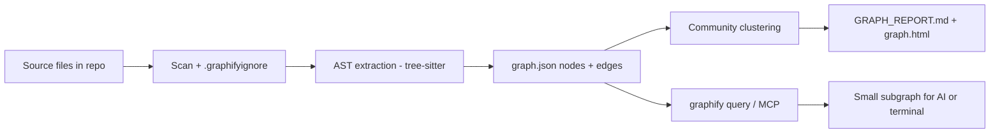
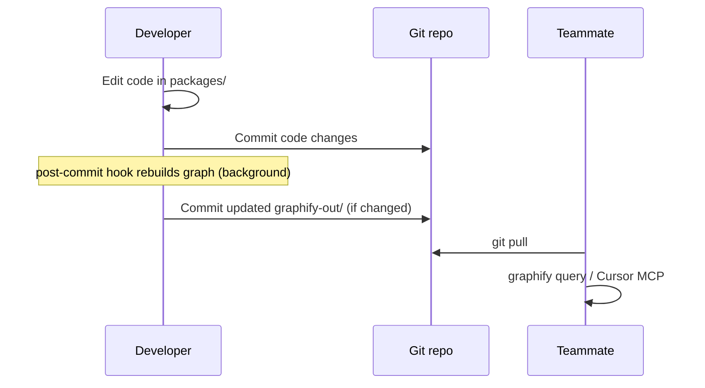

# Graphify in Easy Genomics

This document explains what [Graphify](https://graphifylabs.ai/) is, how it works, how it is set up in this repository,
and how teammates can use it locally — including with **Cursor** and **Claude Code**.

Graphify is **developer tooling**, not a product feature. End users of Easy Genomics never interact with it. It exists
to help engineers and AI assistants navigate a large monorepo faster and with less guesswork.

> **Pilot:** We are trialing Graphify to measure token usage, speed, and answer quality. See
> [Evaluating Graphify (pilot test)](#evaluating-graphify-pilot-test) and contribute results to
> [graphify-evaluation-log.md](./graphify-evaluation-log.md).

---

## Table of contents

1. [What is Graphify?](#what-is-graphify)
2. [How Graphify works](#how-graphify-works)
3. [How it is implemented in this project](#how-it-is-implemented-in-this-project)
4. [Teammate setup (local machine)](#teammate-setup-local-machine)
5. [Usage examples](#usage-examples)
6. [Using Graphify with Cursor](#using-graphify-with-cursor)
7. [Using Graphify with Claude Code](#using-graphify-with-claude-code)
8. [Using Cursor without Graphify (opt-out)](#using-cursor-without-graphify-opt-out)
9. [Team workflow and sharing](#team-workflow-and-sharing)
10. [What is indexed (and what is not)](#what-is-indexed-and-what-is-not)
11. [Troubleshooting](#troubleshooting)
12. [Evaluating Graphify (pilot test)](#evaluating-graphify-pilot-test)
13. [Possible improvements](#possible-improvements)
14. [References](#references)

---

## What is Graphify?

Graphify is an open-source tool ([github.com/safishamsi/graphify](https://github.com/safishamsi/graphify/), PyPI package
**`graphifyy`** — note the double **y**) that turns a folder of source files into a **persistent knowledge graph**:

- **Nodes** — functions, classes, modules, files, concepts
- **Edges** — imports, calls, containment, and (for docs) semantic relationships

Instead of an AI assistant re-reading hundreds of files on every question, you **query the graph** and get a small,
relevant subgraph — file paths, symbols, and how they connect.

### What Graphify is good at

| Strength             | Example question                                  |
| -------------------- | ------------------------------------------------- |
| Cross-file structure | “What calls `LaboratoryRunService`?”              |
| Blast radius         | “What breaks if I change `auth-utils`?”           |
| Domain boundaries    | “How does `nf-tower` connect to `easy-genomics`?” |
| Onboarding           | “Where does HealthOmics run creation start?”      |

### What Graphify is not

| Limitation                            | Use instead                                          |
| ------------------------------------- | ---------------------------------------------------- |
| Business intent (“why we chose X”)    | [CLAUDE.md](../../CLAUDE.md), `docs/`, code comments |
| Runtime behaviour                     | Tests, logs, running the app                         |
| Guaranteed freshness                  | Rebuild after code changes; check graph commit hash  |
| Meeting notes / ad-hoc investigations | Not indexed by default (by design)                   |

Graphify answers **how things are wired**. [CLAUDE.md](../../CLAUDE.md) answers **what owns what and which conventions
apply**. Use both together in Cursor.

---

## How Graphify works

High-level pipeline:



### 1. Corpus selection

Graphify scans the repository and applies [`.graphifyignore`](../../.graphifyignore) (same idea as `.gitignore`). Only
allowed paths are indexed.

### 2. Extraction

| File type                      | Method                       | API key needed?         |
| ------------------------------ | ---------------------------- | ----------------------- |
| Code (`.ts`, `.vue`, `.go`, …) | **AST** via tree-sitter      | No — runs fully offline |
| Docs (`.md`, `.yaml`, …)       | **Semantic** LLM extraction  | Yes                     |
| Images                         | Vision / semantic extraction | Yes                     |

Easy Genomics defaults to **code-only** extraction so any developer can build and refresh the graph without API keys.

### 3. Graph storage

Output lives in `graphify-out/`:

| File              | Purpose                                                                |
| ----------------- | ---------------------------------------------------------------------- |
| `graph.json`      | Full graph — queried by CLI and MCP                                    |
| `GRAPH_REPORT.md` | Summary: node/edge counts, communities, suggested questions, freshness |
| `graph.html`      | Interactive visualization (open in a browser)                          |
| `manifest.json`   | Incremental rebuild metadata                                           |
| `cache/`          | AST cache — speeds rebuilds (committed for team convenience)           |

### 4. Querying

`graphify query "question"` runs a **bounded traversal** (BFS by default) over `graph.json` and returns matching nodes
and relationships — not the entire graph. This keeps token usage low compared to dumping whole files into an AI prompt.

Other CLI commands:

| Command                 | Purpose                                           |
| ----------------------- | ------------------------------------------------- |
| `graphify path "A" "B"` | Shortest dependency path between two symbols      |
| `graphify explain "X"`  | Plain-language summary of a node and neighbors    |
| `graphify affected "X"` | Reverse traversal — what depends on X             |
| `graphify update .`     | Incremental AST refresh after code edits (no LLM) |

### 5. Incremental updates

When a file changes, Graphify can patch only affected nodes instead of rebuilding everything. Post-commit hooks in this
repo trigger **code-only** incremental rebuilds in the background after you commit.

---

## How it is implemented in this project

### Repository files

| Path                                                                       | Role                                                   |
| -------------------------------------------------------------------------- | ------------------------------------------------------ |
| [`.graphifyignore`](../../.graphifyignore)                                 | Default corpus: `packages/**` source only              |
| [`.graphifyignore.with-docs`](../../.graphifyignore.with-docs)             | Alternate corpus for `pnpm graphify:docs`              |
| [`graphify-out/`](../../graphify-out/)                                     | **Committed** graph artifacts shared by the team       |
| [`scripts/graphify-setup.sh`](../../scripts/graphify-setup.sh)             | One-time local setup                                   |
| [`scripts/graphify-build.sh`](../../scripts/graphify-build.sh)             | Rebuild code-only graph                                |
| [`scripts/graphify-docs.sh`](../../scripts/graphify-docs.sh)               | Rebuild with `docs/` + OpenAPI (needs API key)         |
| [`.cursor/rules/graphify.mdc`](../../.cursor/rules/graphify.mdc)           | Cursor rule: query graph before wide search            |
| [`.cursor/rules/easy-genomics.mdc`](../../.cursor/rules/easy-genomics.mdc) | Domain context (pairs with Graphify)                   |
| [`.cursor/mcp.json`](../../.cursor/mcp.json)                               | MCP server config for Cursor Agent                     |
| [`.mcp.json`](../../.mcp.json)                                             | MCP server config for Claude Code                      |
| [`.claude/`](../../.claude/)                                               | Claude Code skill, CLAUDE.md pointer, PreToolUse hooks |
| [`.husky/post-commit`](../../.husky/post-commit)                           | Background graph rebuild after commits                 |
| [`.husky/post-checkout`](../../.husky/post-checkout)                       | Rebuild when switching branches                        |
| [`.gitattributes`](../../.gitattributes)                                   | `graphify-out/graph.json merge=graphify`               |
| [`CLAUDE.md`](../../CLAUDE.md)                                             | Semantic AI guide + Graphify always-on rules           |

### npm scripts (monorepo root)

```bash
pnpm graphify:setup   # Install CLI, hooks, merge driver, Cursor + Claude Code
pnpm graphify:build   # Rebuild code-only graph (no API key)
pnpm graphify:docs    # Rebuild with docs/ (requires LLM API key)
```

### Current graph snapshot

As of the last build (see `graphify-out/GRAPH_REPORT.md` for live numbers):

- **~3,600+ nodes**, **~6,200+ edges** across **628** TypeScript/Vue source files
- **436** communities (clustered modules/files)
- **0 LLM tokens** for the default code-only build

Check freshness in `GRAPH_REPORT.md` → **Graph Freshness** → compare the embedded commit hash with `git rev-parse HEAD`.

### Git integration

1. **Committed graph** — teammates pull `graphify-out/` and query immediately.
2. **Merge driver** — `pnpm graphify:setup` configures `git merge graphify` so parallel edits to `graph.json`
   union-merge instead of leaving conflict markers.
3. **Hooks** — after commits that touch source files, a background job runs `graphify update` logic (code only). If
   `graphify-out/` changes, commit those files in a follow-up or run `pnpm graphify:build` manually.

`graphify-out/cost.json` is **gitignored** (local cost tracking only).

---

## Teammate setup (local machine)

Each developer needs a **one-time** setup. The graph itself comes from git; the CLI and hooks are per machine.

### Prerequisites

- **macOS / Linux / WSL** (primary targets; Windows may need extra PATH setup)
- **Python 3.10+** (usually already present)
- **Git** and **pnpm** (standard for this repo)
- **Cursor** and/or **Claude Code** (optional; each gets MCP + always-on Graphify prompts)

### Step 1 — Clone and install Node deps

```bash
git clone <repo-url>
cd easy-genomics
pnpm install
```

### Step 2 — Run Graphify setup

```bash
pnpm graphify:setup
```

This script:

1. Installs [uv](https://docs.astral.sh/uv/) if missing
2. Installs `graphifyy` via `uv tool install graphifyy`
3. Refreshes Cursor project rules (`graphify install --project --platform cursor`)
4. Installs Claude Code skill + PreToolUse hooks (`graphify install --project --platform claude`)
5. Installs Husky `post-commit` / `post-checkout` hooks
6. Configures the local git merge driver for `graph.json`

### Step 3 — PATH

Ensure Graphify is on your PATH:

```bash
export PATH="$HOME/.local/bin:$PATH"   # add to ~/.zshrc or ~/.bashrc
which graphify
graphify --version
```

### Step 4 — Cursor (optional)

1. **Restart Cursor** after pulling `.cursor/mcp.json`
2. Open **Settings → MCP** and confirm the **`graphify`** server is enabled
3. Use **Agent mode** for questions that benefit from graph queries (Ask mode does not run MCP or terminal)

### Step 5 — Claude Code (optional)

1. Confirm `.claude/settings.json`, `.claude/skills/graphify/`, and `.mcp.json` are present (committed on this branch)
2. **Restart Claude Code** (or start a new session) in the repo root
3. Ensure `graphify` and `graphify-mcp` are on `PATH` inside that session
4. Optionally run `/graphify` once if you need a rebuild; for day-to-day navigation use `graphify query` (or MCP tools)

### Step 6 — Verify

```bash
graphify query "where is create-laboratory-run handled?" --budget 800
open graphify-out/graph.html   # macOS; use xdg-open on Linux
```

You do **not** need to run `pnpm graphify:build` on first clone if `graphify-out/` is already committed on your branch.

### Setup without an IDE assistant

Graphify still works from the terminal (`graphify query`, `path`, `explain`) without Cursor or Claude Code. See
[upstream install docs](https://github.com/safishamsi/graphify/) for other platforms (Codex, etc.).

---

## Usage examples

### Terminal — exploration

```bash
# Broad structural question
graphify query "how does laboratory run creation flow to SNS?"

# Limit output size (tokens)
graphify query "HealthOmics create run execution" --budget 1000

# Dependency path between two symbols
graphify path "create-laboratory-run" "LaboratoryRunService"

# What depends on a module (reverse impact)
graphify affected "auth-utils" --depth 2

# Human-readable neighborhood
graphify explain "nf-tower workflow execution"
```

### Terminal — maintenance

```bash
# After editing .ts / .vue files (fast, no API key)
graphify update .

# Full code rebuild
pnpm graphify:build

# Include docs/ and OpenAPI (needs API key)
export GEMINI_API_KEY=your-key
pnpm graphify:docs

# Optional: pick backend explicitly
GRAPHIFY_BACKEND=anthropic ANTHROPIC_API_KEY=... pnpm graphify:docs
```

### Example output (query)

```text
$ graphify query "what calls laboratory-run-service?" --budget 500

Traversal: BFS depth=2 | Start: ['LaboratoryRunService', ...] | 35 nodes found

NODE create-laboratory-run.lambda.ts [src=packages/back-end/.../create-laboratory-run.lambda.ts ...]
NODE LaboratoryRunService [src=packages/back-end/.../laboratory-run-service.ts ...]
...
```

Use the `src=` paths to open the right files instead of searching the whole monorepo.

### Easy Genomics — example questions

| You want to…                    | Try                                                                       |
| ------------------------------- | ------------------------------------------------------------------------- |
| Trace a lab run from UI to API  | `graphify query "run-workflow page to create-laboratory-run"`             |
| Find HealthOmics entry points   | `graphify query "aws-healthomics create run execution handlers"`          |
| See Seqera integration surface  | `graphify explain "create-workflow-execution"`                            |
| Check blast radius of a service | `graphify affected "laboratory-run-service"`                              |
| Map data collections feature    | `graphify query "sequence set tagging data collections"`                  |
| Compare domains                 | `graphify path "easy-genomics" "nf-tower"` (symbol names may need tuning) |

### Interactive visualization

```bash
open graphify-out/graph.html
```

Use search and community filters to explore clusters. Larger nodes (god-nodes) are highly connected — good candidates
for “what breaks if this changes?”

---

## Using Graphify with Cursor

### What Cursor loads automatically

| Mechanism               | When it applies                                                                         | Effect                                                        |
| ----------------------- | --------------------------------------------------------------------------------------- | ------------------------------------------------------------- |
| `.cursor/rules/*.mdc`   | Every chat (rules with `alwaysApply: true` always; others when matching files are open) | Instructs the agent on domain context and to prefer Graphify  |
| `.cursor/mcp.json`      | Agent mode, when MCP enabled                                                            | Exposes `query_graph`, `shortest_path`, `get_neighbors`, etc. |
| `graphify-out/` on disk | When agent or MCP reads/queries it                                                      | Structural answers without full-repo grep                     |

Graphify does **not** silently inject the entire graph into every prompt. The agent must follow rules and call MCP or
`graphify query`.

### Recommended prompts in Cursor (Agent mode)

```
Trace how a lab workflow run is created from the Nuxt UI through to
DynamoDB. Use the graphify MCP or graphify query before reading files.

I'm changing laboratory run retention TTL. Which services and lambdas
are involved? Use graphify affected on laboratory-run-ttl-utils.

What's the difference between aws-healthomics and nf-tower run paths?
Check CLAUDE.md domain map and graphify for wiring.
```

### Ask mode vs Agent mode

| Mode      | Graphify benefit                                                  |
| --------- | ----------------------------------------------------------------- |
| **Agent** | Full — MCP tools, terminal `graphify query`, targeted file reads  |
| **Ask**   | Partial — rule text only; paste a query result or switch to Agent |

### Pairing with CLAUDE.md

| Layer                        | Provides                                                                                              |
| ---------------------------- | ----------------------------------------------------------------------------------------------------- |
| Graphify                     | Structure: calls, imports, files, communities                                                         |
| [CLAUDE.md](../../CLAUDE.md) | Semantics: `easy-genomics` vs `aws-healthomics` vs `nf-tower`, auth, error handling, handler patterns |

---

## Using Graphify with Claude Code

### What Claude Code loads automatically

| Mechanism                         | When it applies                                      | Effect                                                               |
| --------------------------------- | ---------------------------------------------------- | -------------------------------------------------------------------- |
| `CLAUDE.md` `## graphify` section | Every Claude Code session in this repo               | Instructs Claude to run `graphify query` / `path` / `explain` first  |
| `.claude/skills/graphify/`        | When you invoke `/graphify`                          | Full Graphify skill (build, update, query helpers)                   |
| `.claude/settings.json` hooks     | Before Bash grep/`rg`/`find` and before Read/Glob of | Injects a reminder to query the graph when `graphify-out/graph.json` |
|                                   | source-like paths                                    | exists                                                               |
| `.mcp.json`                       | When MCP is enabled for the project                  | Same `graphify-mcp` tools as Cursor                                  |
| `graphify-out/` on disk           | When Claude or MCP queries it                        | Structural answers without full-repo grep                            |

Claude Code does **not** use `.cursor/rules/*.mdc`. Domain conventions still come from root
[`CLAUDE.md`](../../CLAUDE.md).

### Recommended prompts

```
Trace how a lab workflow run is created from the Nuxt UI through to
DynamoDB. Run graphify query before grepping or reading files broadly.

What's the blast radius of LaboratoryRunService? Use graphify affected.
```

### Opt-out for Claude Code

| Approach                  | How                                                                                                             |
| ------------------------- | --------------------------------------------------------------------------------------------------------------- |
| Skip hooks for this clone | Edit or remove PreToolUse entries in `.claude/settings.json` (do not commit that change unless the team agrees) |
| Disable MCP               | Remove or disable the `graphify` server in Claude Code MCP settings / omit using `.mcp.json`                    |
| Per-chat                  | Tell Claude: “Ignore Graphify for this chat; use Read/Grep only.”                                               |

---

## Using Cursor without Graphify (opt-out)

Graphify is **optional**. The repo works normally without it; you can use Cursor exactly as you would in any other
project. Committed files such as `graphify-out/` and `.cursor/rules/graphify.mdc` do not run by themselves — they only
matter if Cursor loads them or you invoke the CLI.

### Quick opt-out (recommended)

Do **not** run `pnpm graphify:setup`. Then:

1. **Disable the Graphify MCP server** in Cursor: **Settings → MCP** → turn off the **`graphify`** server (or leave it
   off if you never enabled it).
2. **Disable the Graphify project rule** in Cursor: **Settings → Rules** → under Project rules, disable **`graphify`**
   (`graphify.mdc`). Leave **`easy-genomics`** enabled if you still want domain context from
   [CLAUDE.md](../../CLAUDE.md).

After that, Cursor will not be instructed to call Graphify and will not expose Graphify MCP tools. The agent falls back
to its usual Read / Grep / Glob behaviour.

Restart Cursor after changing MCP or rules.

### What you can keep without Graphify

| Still useful                                | Graphify-specific (skip)         |
| ------------------------------------------- | -------------------------------- |
| [CLAUDE.md](../../CLAUDE.md)                | `graphify query` / MCP           |
| `.cursor/rules/easy-genomics.mdc`           | `.cursor/rules/graphify.mdc`     |
| `.cursor/rules/backend.mdc`, `frontend.mdc` | `pnpm graphify:setup`            |
| Normal Cursor workflow                      | `graphify-out/` (ignore on disk) |

You do **not** need to delete `graphify-out/` from your clone; it is inert unless something reads or queries it.

### Optional: tell the agent explicitly

In a chat or in **Cursor Settings → Rules → User rules**, add:

```
Do not use Graphify, graphify query, or the graphify MCP server in this project.
Use normal file search and reading only.
```

User rules apply across projects; use this only if you want Graphify disabled everywhere, or combine with the
project-rule toggle above for this repo only.

### Opt-out of git hooks (if you already ran setup)

`pnpm graphify:setup` installs post-commit / post-checkout hooks that rebuild the graph in the background. To stop that:

```bash
graphify hook uninstall
```

Or skip hooks for a single commit:

```bash
GRAPHIFY_SKIP_HOOK=1 git commit -m "your message"
```

You do not need Graphify installed to work on the codebase; hooks exit quietly if the CLI is missing.

### Per-chat override

For one conversation without changing settings:

```
Ignore Graphify for this chat. Do not run graphify query or use the graphify MCP.
```

### Team vs individual choice

| Scope                               | Approach                                                                                                                           |
| ----------------------------------- | ---------------------------------------------------------------------------------------------------------------------------------- |
| **Just you**                        | Disable MCP + `graphify.mdc` in Cursor settings; skip `graphify:setup`                                                             |
| **You ran setup earlier**           | `graphify hook uninstall`                                                                                                          |
| **Whole team stops using Graphify** | Separate decision — remove committed integration via PR (rules, MCP config, hooks). Not required for one person to opt out locally |

### What does _not_ opt you out

| Action                                   | Still happens                                       |
| ---------------------------------------- | --------------------------------------------------- |
| Pulling `graphify-out/`                  | Files on disk only; no effect on Cursor unless used |
| Other teammates committing graph updates | Harmless for you if MCP/rules are off               |
| Keeping `easy-genomics.mdc` enabled      | Agent still gets domain map; it is not Graphify     |

---

## Team workflow and sharing

### Standard workflow



### Who rebuilds the graph?

| Situation                                | Action                                                                    |
| ---------------------------------------- | ------------------------------------------------------------------------- |
| Pulled branch with fresh `graphify-out/` | Query only — no rebuild needed                                            |
| You changed code on your branch          | `graphify update .` or `pnpm graphify:build`, then commit `graphify-out/` |
| Docs changed and should be in graph      | `pnpm graphify:docs` (API key), commit `graphify-out/`                    |
| Merge conflict on `graph.json`           | Run `pnpm graphify:setup` once; or `pnpm graphify:build` after merge      |

### What to commit

| Commit                                                                  | Do not commit                                                           |
| ----------------------------------------------------------------------- | ----------------------------------------------------------------------- |
| `graphify-out/graph.json`, `GRAPH_REPORT.md`, `manifest.json`, `cache/` | `graphify-out/cost.json`                                                |
| `.graphifyignore`, scripts, `.cursor/rules/`, `.cursor/mcp.json`        | Local API keys                                                          |
| `.mcp.json`, `.claude/` (skill, settings hooks, CLAUDE.md pointer)      | Machine-specific git config (merge driver is local per clone via setup) |
| `.husky/post-commit`, `post-checkout` (if present)                      |                                                                         |

---

## What is indexed (and what is not)

Controlled by [`.graphifyignore`](../../.graphifyignore):

| Included (default)                | Excluded (default)                                          |
| --------------------------------- | ----------------------------------------------------------- |
| `packages/**` `.ts`, `.vue`, etc. | `docs/**`                                                   |
|                                   | `**/*.md`, `**/*.yaml` (need LLM)                           |
|                                   | `public/`, `assets/`, images                                |
|                                   | `node_modules/`, `coverage/`, `cdk.out/`, `.nuxt/`, `dist/` |
|                                   | Generated `*.d.ts`                                          |
|                                   | Meeting transcripts, local investigations                   |

To add `docs/` temporarily, use `pnpm graphify:docs` (see
[`.graphifyignore.with-docs`](../../.graphifyignore.with-docs)).

**Do not** add meeting transcripts or unreviewed investigation notes to the shared graph without team agreement — stale
or informal content can mislead AI assistants.

---

## Troubleshooting

| Issue                                   | Fix                                                                                        |
| --------------------------------------- | ------------------------------------------------------------------------------------------ |
| `graphify: command not found`           | `pnpm graphify:setup` or `uv tool install graphifyy`; add `~/.local/bin` to PATH           |
| `no LLM API key found` during build     | Use `pnpm graphify:build` (code-only), not `graphify:docs`                                 |
| Stale graph / wrong structure           | Compare `GRAPH_REPORT.md` commit hash vs `git rev-parse HEAD`; run `graphify update .`     |
| MCP server not in Cursor                | Restart Cursor; check Settings → MCP; verify `which graphify-mcp`                          |
| MCP server not in Claude Code           | Confirm `.mcp.json` exists; restart Claude Code; verify `which graphify-mcp`               |
| Claude Code ignores Graphify            | Confirm `.claude/settings.json` hooks; restart session; prompt: “use graphify query first” |
| Hook rebuild fails silently             | Read `~/.cache/graphify-rebuild.log`                                                       |
| `graph.json` merge conflicts            | `pnpm graphify:setup` (merge driver); then `pnpm graphify:build` if needed                 |
| Reinstalled / upgraded Graphify         | Re-run `graphify hook install` and `pnpm graphify:setup`                                   |
| Agent ignores Graphify                  | Use Agent mode; prompt explicitly: “use graphify query first”                              |
| Want to use Cursor **without** Graphify | See [Using Cursor without Graphify (opt-out)](#using-cursor-without-graphify-opt-out)      |
| Communities named `Community N`         | Normal without LLM for labeling; run `graphify:docs` or `graphify label` with API key      |

---

## Evaluating Graphify (pilot test)

Graphify is integrated as a **trial**. We want evidence on whether it actually reduces **token usage**, improves
**response time**, and produces **better answers** for real Easy Genomics tasks — or adds overhead without benefit.

Teammates are encouraged to run controlled comparisons and record results in
[graphify-evaluation-log.md](./graphify-evaluation-log.md).

### What to measure

| Metric                   | What it tells you                       | Where to get it                                           |
| ------------------------ | --------------------------------------- | --------------------------------------------------------- |
| **Wall-clock time**      | Perceived speed (prompt → final answer) | Stopwatch or phone timer                                  |
| **Tokens**               | Context cost (primary Graphify claim)   | Cursor chat usage panel (if shown), or provider dashboard |
| **Tool calls**           | How much searching the agent did        | Count in Agent transcript (Read, Grep, Glob, MCP, Bash)   |
| **Files touched**        | Did it open the right code quickly?     | Transcript — list paths read                              |
| **Answer quality (1–5)** | Correct, complete, actionable?          | Your judgment (see rubric below)                          |
| **First-try success**    | Right area without correction?          | yes / no                                                  |

**Quality rubric (1–5):**

| Score | Meaning                                     |
| ----- | ------------------------------------------- |
| 5     | Correct files and explanation; no bad leads |
| 4     | Mostly right; minor extra reads             |
| 3     | Eventually right after extra searching      |
| 2     | Partially wrong or missed key files         |
| 1     | Wrong area or hallucinated structure        |

### Level 1 — CLI token benchmark (quick, no Cursor)

Estimates how many tokens a **graph query** costs vs reading the whole indexed corpus naively. Run after pulling or
rebuilding `graphify-out/`:

```bash
graphify benchmark graphify-out/graph.json
```

Example output shape:

```text
Corpus:          ~242,200 tokens (naive full read)
Avg query cost:  ~35,685 tokens
Reduction:       6.8x fewer tokens per query
```

This is a **model**, not a real Cursor bill — but useful to see order-of-magnitude savings on structural questions.
Paste snapshots into [graphify-evaluation-log.md](./graphify-evaluation-log.md).

Optional — time a single query:

```bash
time graphify query "what calls laboratory-run-service?" --budget 1000
```

### Level 2 — Cursor A/B test (main pilot)

Compare the **same question** twice in **Agent mode**, once with Graphify enabled and once with it disabled.

#### Before you start

| Arm                  | Setup                                                                                                                  |
| -------------------- | ---------------------------------------------------------------------------------------------------------------------- |
| **With Graphify**    | `pnpm graphify:setup`; MCP **on**; rule **`graphify.mdc` enabled**; fresh Agent chat                                   |
| **Without Graphify** | MCP **off**; rule **`graphify.mdc` disabled**; see [opt-out](#using-cursor-without-graphify-opt-out); fresh Agent chat |

Use a **new chat** for each run so context does not carry over. Keep **`easy-genomics.mdc` enabled in both arms** so you
are isolating Graphify, not domain rules.

Use the **same Cursor model** for both arms when possible.

#### Standard test queries

Pick at least one **navigation** and one **cross-domain** question per session:

| ID  | Query (paste exactly into Cursor)                                                                                                                                 |
| --- | ----------------------------------------------------------------------------------------------------------------------------------------------------------------- |
| Q1  | Trace how a laboratory run is created from the Nuxt UI through to the back-end service and SNS. List the main files in order.                                     |
| Q2  | What calls or imports `LaboratoryRunService`? What is the blast radius if I change it?                                                                            |
| Q3  | How does HealthOmics run creation (`aws-healthomics`) differ from Seqera workflow launch (`nf-tower`)? Name entry-point lambdas and front-end repository modules. |
| Q4  | Where is laboratory authorization checked for data collection APIs?                                                                                               |
| Q5  | What is the path from `create-laboratory-run.lambda.ts` to DynamoDB persistence?                                                                                  |

Add your own task if it matches real work you do — note it in the log.

#### With Graphify — prompt suffix (optional)

```
Use the graphify MCP or run graphify query before grepping or reading files broadly.
```

#### Without Graphify — prompt suffix (required)

```
Do not use Graphify, graphify query, or the graphify MCP. Use only Read, Grep, and Glob.
```

#### Record each run

Fill a row in [graphify-evaluation-log.md](./graphify-evaluation-log.md):

| Field                | Example                                            |
| -------------------- | -------------------------------------------------- |
| Date                 | 2026-06-18                                         |
| Tester               | your name or email                                 |
| Query                | Q2                                                 |
| Arm                  | `with` or `without`                                |
| Time (s)             | 52                                                 |
| Tokens               | 14000 (if visible)                                 |
| Tool calls           | 5                                                  |
| Correct files found? | yes                                                |
| Answer quality       | 4                                                  |
| Notes                | With: 1 MCP + 2 reads. Without: 4 greps + 7 reads. |

#### Contribution workflow

1. Run **both arms** for the same query ID.
2. Append rows to `docs/development/graphify-evaluation-log.md`.
3. Open a PR titled e.g. `docs: graphify evaluation Q2 — @yourname`.
4. Optionally paste `graphify benchmark` output when the graph on your branch matches `main`.

### Level 3 — Spot-check accuracy

Tokens and speed are not enough if answers are wrong. For each A/B pair, verify:

- [ ] Named lambdas/services **exist** at the paths given
- [ ] Import/call relationships match `grep` or your IDE
- [ ] No confident claims about files not in `packages/`

If **without** Graphify scores higher on quality but uses more tokens, note that — the pilot is a tradeoff, not
tokens-only.

### Controlling bias

| Do                                         | Avoid                                             |
| ------------------------------------------ | ------------------------------------------------- |
| New chat per run                           | Continuing the same thread                        |
| Same model settings                        | Switching models between arms                     |
| Record failures honestly                   | Only logging wins                                 |
| Test on current `graphify-out/`            | Stale graph (check `GRAPH_REPORT.md` commit hash) |
| Run with and without on the **same** query | Different wording between arms                    |

### Interpreting results

| Outcome                                               | Suggested action                                                              |
| ----------------------------------------------------- | ----------------------------------------------------------------------------- |
| Lower tokens **and** faster **and** quality ≥ without | Strong case to keep integration                                               |
| Lower tokens but similar time                         | Keep; agent may still save cost                                               |
| Similar tokens, faster                                | Keep for speed; review if rules cause extra MCP calls                         |
| Higher tokens (e.g. query + reads)                    | Tune rules; try CLI-only without MCP; narrow `--budget`                       |
| Worse quality with Graphify                           | Stale graph, over-trust of graph, or wrong query type — log and rebuild graph |
| No clear difference                                   | Test harder navigation queries (Q2–Q5); pilot may not help simple edits       |

Maintainers update the summary table in [graphify-evaluation-log.md](./graphify-evaluation-log.md) when enough data
exists to decide **keep / adjust / remove**.

### Pilot status

| Item             | Status                                                                        |
| ---------------- | ----------------------------------------------------------------------------- |
| Integration      | Trial on this branch                                                          |
| Success criteria | TBD by team (e.g. median token reduction ≥ 30% on Q1–Q5 without quality drop) |
| Evaluation log   | [graphify-evaluation-log.md](./graphify-evaluation-log.md)                    |

---

## Possible improvements

Ideas for the team to consider as Graphify adoption matures:

### Near term (low effort)

| Improvement                                                                | Benefit                                                                                                         |
| -------------------------------------------------------------------------- | --------------------------------------------------------------------------------------------------------------- |
| **Commit `graphify-out/` on every meaningful PR** that changes `packages/` | Teammates and CI always have an up-to-date map                                                                  |
| **Run `pnpm graphify:docs` periodically** (e.g. after major doc updates)   | Graph answers deployment and contributing questions                                                             |
| **PR template reminder**                                                   | “If you changed `packages/`, refresh and commit `graphify-out/`”                                                |
| **Name communities**                                                       | Run `graphify label` with an API key so `GRAPH_REPORT.md` shows readable cluster names instead of `Community N` |

### Medium term

| Improvement                          | Benefit                                                                                      |
| ------------------------------------ | -------------------------------------------------------------------------------------------- |
| **CI job to verify graph freshness** | Fail or warn if `GRAPH_REPORT.md` commit ≠ `HEAD` on PRs touching `packages/`                |
| **Shared MCP HTTP server**           | Team points Cursor at one `graphify serve --transport http` instance — no local CLI required |
| **OpenAPI in default corpus**        | Adjust `.graphifyignore` to include `easy-genomics-api.yaml` via `graphify:docs` workflow    |
| **Onboarding doc link**              | Point new engineers to this page + `CLAUDE.md` on day one                                    |

### Longer term / evaluate carefully

| Improvement                                              | Tradeoff                                                                 |
| -------------------------------------------------------- | ------------------------------------------------------------------------ |
| **Enterprise Graphify Cloud**                            | Managed team graph, SSO — cost and ops vs committed `graphify-out/`      |
| **Auto-inject `GRAPH_REPORT.md` into every Cursor turn** | More context but higher token usage and anchoring risk                   |
| **Index meeting transcripts**                            | Useful for decisions — risk of stale/wrong “facts” in a regulated domain |
| **Replace code review with graph-only navigation**       | Graph complements grep/tests; does not replace them                      |

### Known limitations to plan around

- Graph shows **static structure**, not runtime paths (e.g. which branch of a conditional runs).
- **Python 3.13** may skip some optional Leiden clustering features; core AST graph still works.
- Post-commit hooks pin a **machine-specific Python path**; teammates should run `pnpm graphify:setup` locally (fallback
  detection still works for most cases).
- **Ask mode** in Cursor cannot run Graphify tools — structural questions need Agent mode.

---

## References

- [Graphify website](https://graphifylabs.ai/)
- [Graphify GitHub](https://github.com/safishamsi/graphify/)
- PyPI: `graphifyy` (CLI command: `graphify`)
- [CLAUDE.md](../../CLAUDE.md) — project semantics for AI assistants
- [contributing.md](./contributing.md) — branch conventions and coding principles
