# Your first workflow run

This guide walks you through the core Easy Genomics journey after deployment: sign in, set up an organization and lab,
connect AWS HealthOmics or Seqera Cloud, invite a colleague, upload sample data, launch a workflow, and review the
results.

If you have not deployed Easy Genomics yet, complete [Prerequisites and Preparation](./prerequisites.md) and
[Installation](./install.md) first. **You do not need any other documentation to finish this guide.**

> **Production vs non-production:** On `env-type: dev` or `pre-prod`, deploy may seed a **Default Organization**, test
> users, and a **Test Laboratory**. On **`prod`**, only the System Admin account is created—you must create an
> organization yourself. This guide follows a greenfield path (create org + lab) so it works for production; skip
> organization creation if your environment already has one you plan to use.

## Before you start

Collect the following before you begin:

| Item                                                                                                    | Where it comes from                                                                                                                                         |
| ------------------------------------------------------------------------------------------------------- | ----------------------------------------------------------------------------------------------------------------------------------------------------------- |
| **Application URL**                                                                                     | Output of `pnpm run build-and-deploy` (`ApplicationUrl`) — see [install.md](./install.md)                                                                   |
| **System Admin email and password**                                                                     | `sys-admin-email` / `sys-admin-password` in `easy-genomics.yaml`                                                                                            |
| **Organization Admin**                                                                                  | Optional seeded `org-admin-email` on non-prod, or an user you invite and grant org-admin access                                                             |
| **Seqera Cloud workspace ID and [personal access token](https://docs.seqera.io/platform/latest/token)** | Your Seqera Cloud account                                                                                                                                   |
| **AWS HealthOmics workflows**                                                                           | Workflows visible in your AWS account / HealthOmics console                                                                                                 |
| **GitHub personal access token**                                                                        | Required when enabling HealthOmics on a lab (Contents: Read-only is typical for public workflow repos)                                                      |
| **Sample FASTQ files**                                                                                  | Paired-end reads, e.g. `*_R1_*.fastq.gz` and `*_R2_*.fastq.gz` (the project E2E fixtures use `NA1287820K_R1_001.fastq.gz` and `NA1287820K_R2_001.fastq.gz`) |

Replace `{ApplicationUrl}` below with your deployed URL (for example `https://quality.uat.easygenomics.org`).

---

## 1. First login and account verification

### Sign in as System Admin

1. Open **`{ApplicationUrl}/signin`** in your browser.
2. Enter the **System Admin** email and password from your `easy-genomics.yaml` configuration.
3. Choose **Sign in**.


After a successful login you are taken to the home screen (System Admins may land on **Organizations**).


### Account verification

**Deploy-created accounts** (System Admin and optional seeded test users on non-prod) are created in Amazon Cognito with
`email_verified` set and a permanent password. There is **no separate email confirmation step** for those accounts—you
can sign in immediately after deploy.

**Invited users** follow a different path:

1. An organization admin sends an invite (see [section 4](#4-invite-a-team-member-and-assign-a-role)).
2. The invitee opens the link in the invitation email and completes the **Accept invitation** form (first name, last
   name, password).
3. They are redirected to sign in with the invited email pre-filled:

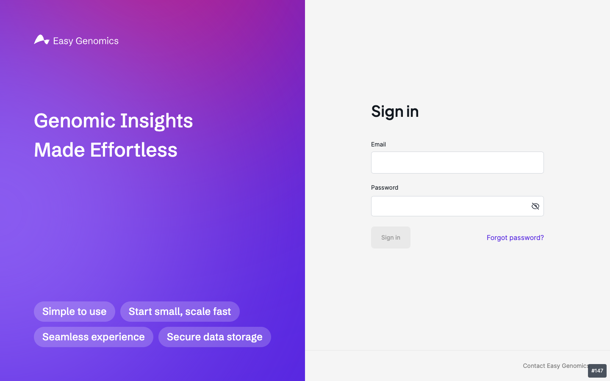

If your deployment enables Google single sign-in (`google-client-id` in `easy-genomics.yaml`), you may also use **Sign
in with Google** on the sign-in page.

---

## 2. Create an organization

Only a **System Admin** can create organizations.

1. Open **Organizations** from the top navigation.
2. Choose **Create a new Organization**.
3. Enter an **organization name** and **description**.
4. Optionally set the **Default Seqera Endpoint URL** (defaults to the value in `easy-genomics.yaml`, typically
   `https://api.cloud.seqera.io`).
5. Choose **Save changes**. You should see a toast: **Organization created**.

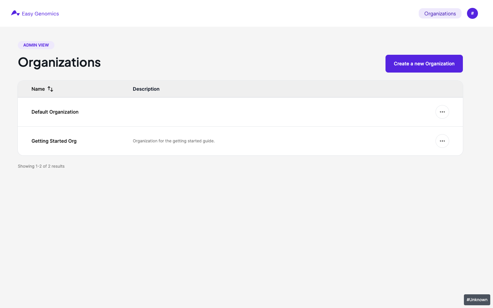

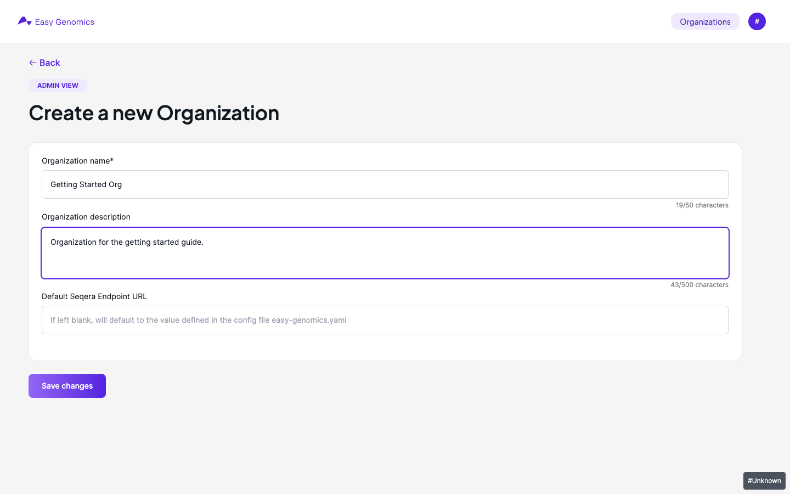

---

## 3. Create a laboratory

Sign in as an **Organization Admin** (sign out the System Admin first, or use your org-admin account).

1. Open **Labs** → **Create a new Lab**.
2. Fill in **Lab Name** and **Lab Description**.
3. Under **Default S3 bucket directory**, select the lab upload bucket created during deploy (non-prod environments
   provision a shared lab bucket automatically).
4. Connect your analysis platforms (you can enable **both** on one lab):

### Connect Seqera Cloud

1. Turn on **Enable Seqera Integration**.
2. Enter your Seqera **Workspace ID**.
3. Enter your Seqera **Personal Access Token** (stored securely; never shown again after save).
4. Confirm the **Seqera endpoint URL** (pre-filled from the organization).

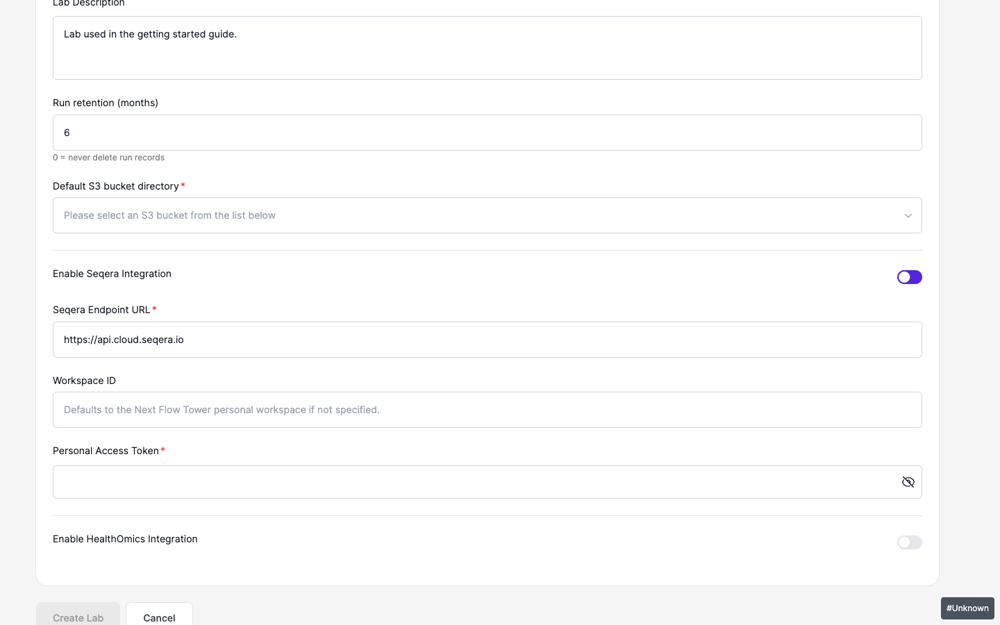

### Connect AWS HealthOmics

1. Turn on **Enable HealthOmics Integration**.
2. Enter a **GitHub Personal Access Token** when creating the lab (used to fetch workflow schemas from GitHub).


5. Choose **Create Lab**. You should see: **Successfully created Lab: …**

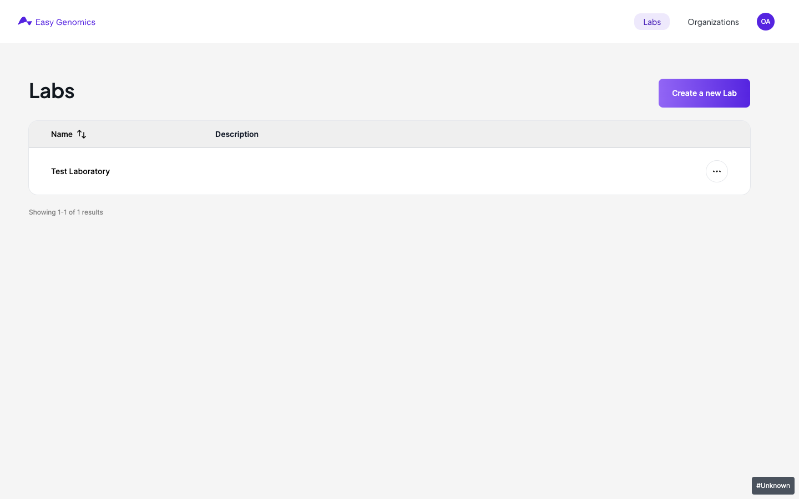

6. Open the lab → **Settings** to confirm integrations are enabled.

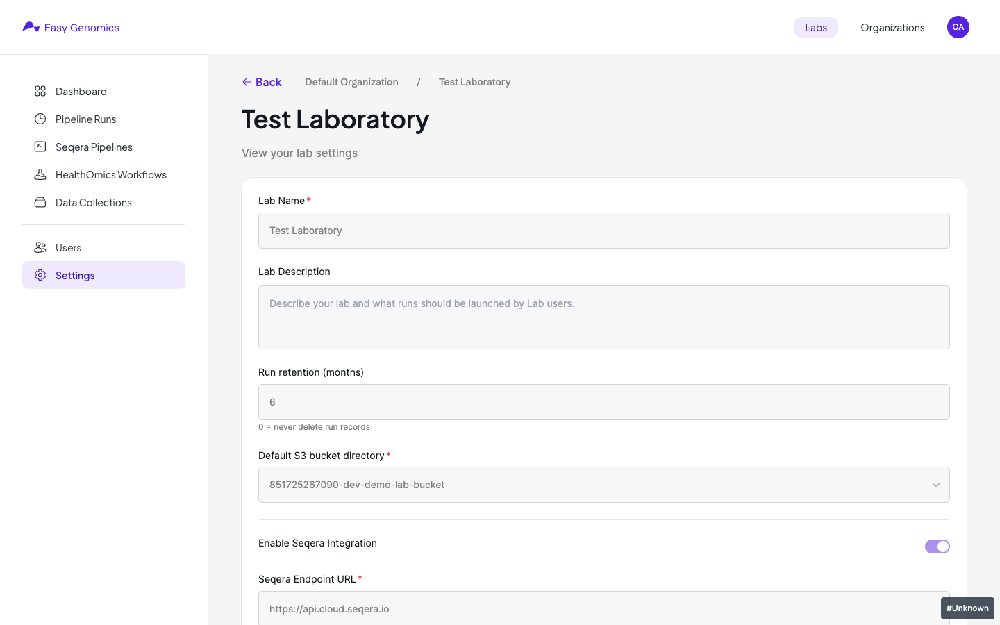

---

## 4. Invite a team member and assign a role

Organization Admins (and System Admins) manage membership at the organization level. Lab Managers can add existing org
members to a lab.

### Invite someone to the organization

1. **Organizations** → select your organization → **View / Edit**.
2. Open the **All users** tab.
3. Choose **Invite users**, enter an email address, and choose **Invite**.
4. The invitee receives an email with an activation link (see [section 1](#1-first-login-and-account-verification)).

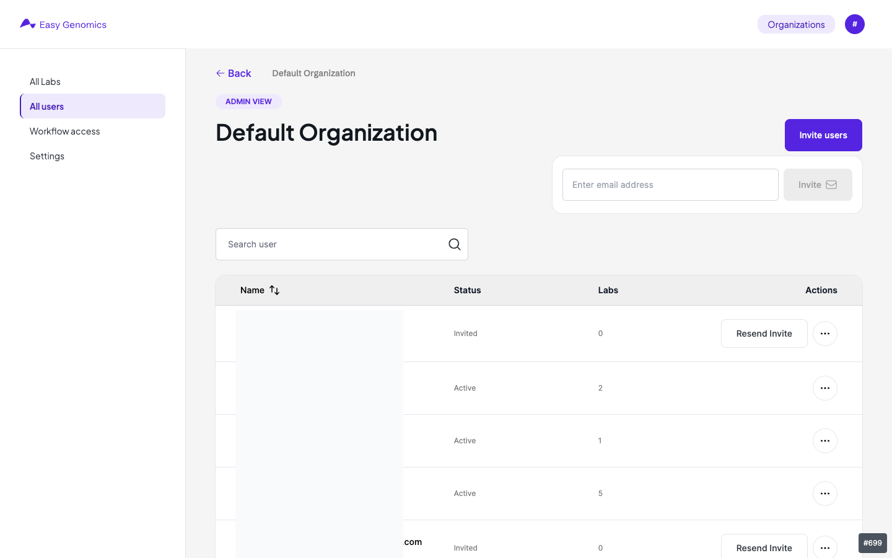

### Assign organization and lab roles

1. On **All users**, open the row menu for a user → **Edit User Access**.
2. Toggle **Organization Admin** to grant org-wide admin rights.
3. In the lab table, use the role dropdown to assign **Lab Manager** or **Lab Technician** per lab.

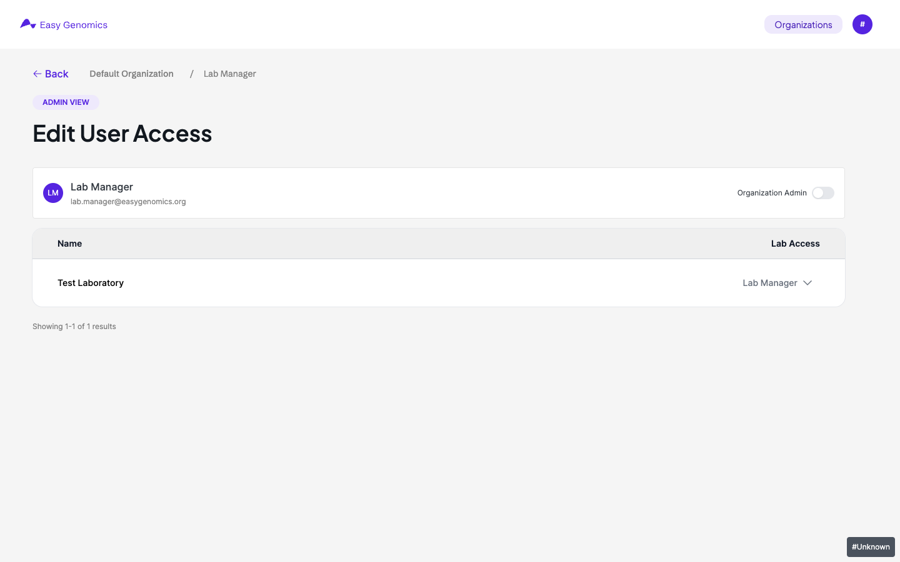

### Add a user to a lab

For users who are already in the organization but not yet on a lab:

1. Open the lab → **Users** tab.
2. Choose **Add Lab Users**, select the user, and choose **Add**.

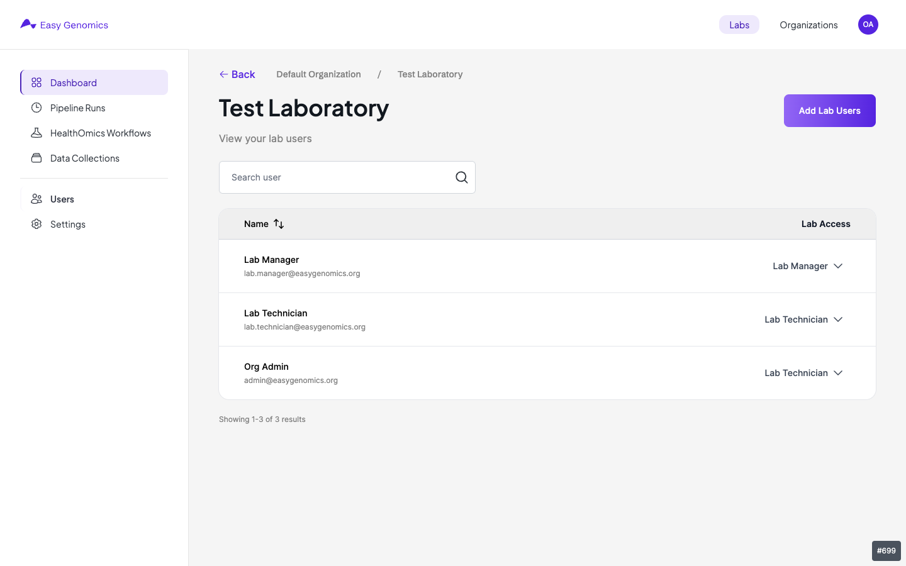

| Role                   | Can create labs | Can invite org users | Can launch runs             |
| ---------------------- | --------------- | -------------------- | --------------------------- |
| **Organization Admin** | Yes             | Yes                  | Yes (with lab access)       |
| **Lab Manager**        | No              | No                   | Yes                         |
| **Lab Technician**     | No              | No                   | Yes (limited by lab policy) |

---

## 5. Upload sample data

Lab Managers and Organization Admins with lab access can upload data and launch runs. The run wizard requests a **file
upload manifest** (presigned S3 URLs), uploads your FASTQ files, then generates a **sample sheet CSV** automatically.
You can optionally upload a custom sample sheet instead; this guide uses the default auto-generated path.

The upload steps are **the same for Seqera and HealthOmics**; only the lab tab you start from differs.

### Shared upload steps

1. Open your lab.
2. Choose a platform tab — **Seqera Pipelines** or **HealthOmics Workflows** — and open the row menu for a
   pipeline/workflow → **Run**.
3. **Step 1 — Run details:** enter a unique **Run Name** → **Save & Continue**.

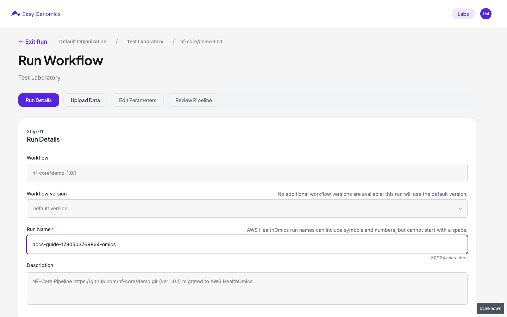

4. **Step 2 — Upload data:**
   - Choose **Choose Files** and select your paired FASTQ files (R1 and R2).
   - Choose **Upload Files**. Easy Genomics requests an upload manifest, uploads files to your lab S3 prefix, then
     builds a sample sheet.
   - When upload completes, note the sample sheet S3 URL bar and **Download sample sheet**.

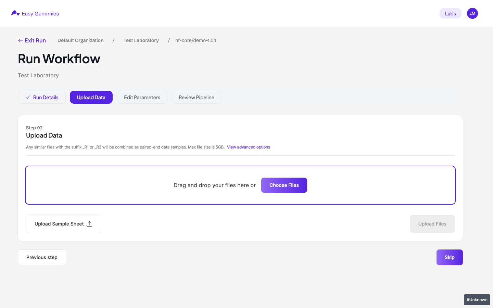

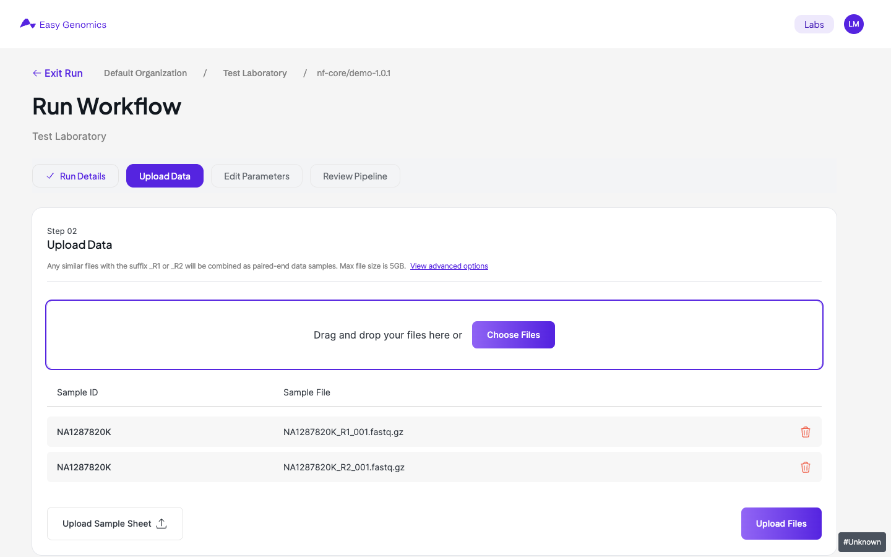

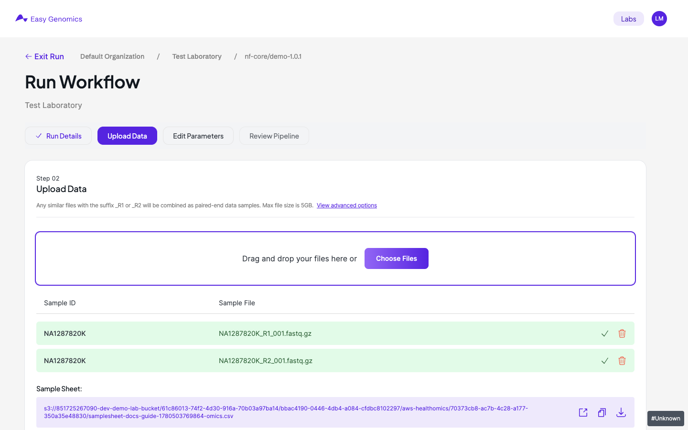

5. Choose **Next step** to continue to workflow parameters.

Example auto-generated sample sheet columns (your file names will differ):

```csv
sample,fastq_1,fastq_2
NA1287820K,s3://your-bucket/org-id/lab-id/.../NA1287820K_R1_001.fastq.gz,s3://your-bucket/.../NA1287820K_R2_001.fastq.gz
```

---

## 6. Launch a workflow and monitor the run

The wizard has four steps: **Run details** → **Upload data** → **Parameters** → **Review & launch**. Parameter fields
such as `input` / `Input` and `outdir` are pre-filled from the sample sheet.

### Option A — Seqera Cloud

1. Open the lab → **Seqera Pipelines**.

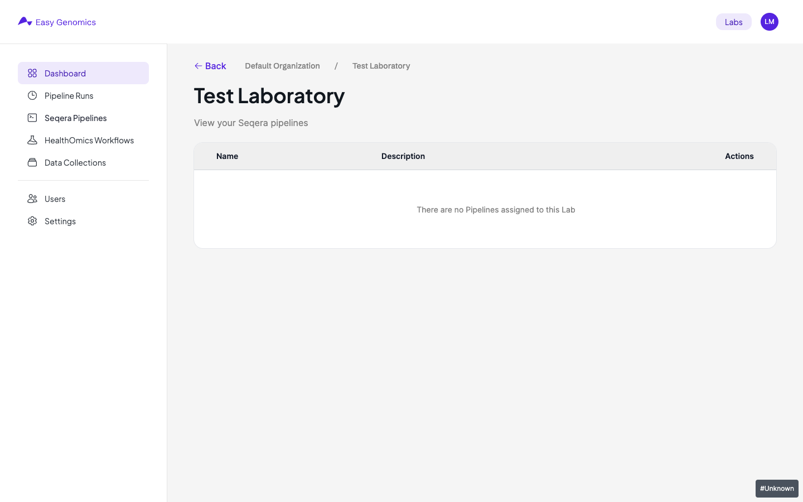

2. Row menu → **Run** (same upload steps as [section 5](#5-upload-sample-data)).
3. **Parameters:** review `input` / `outdir` (or **Input/output options**) → **Save & Continue**.


4. **Review:** choose **Launch Pipeline Run**.
5. Choose **Back to Runs** to open **Pipeline Runs**.


### Option B — AWS HealthOmics

1. Open the lab → **HealthOmics Workflows**.

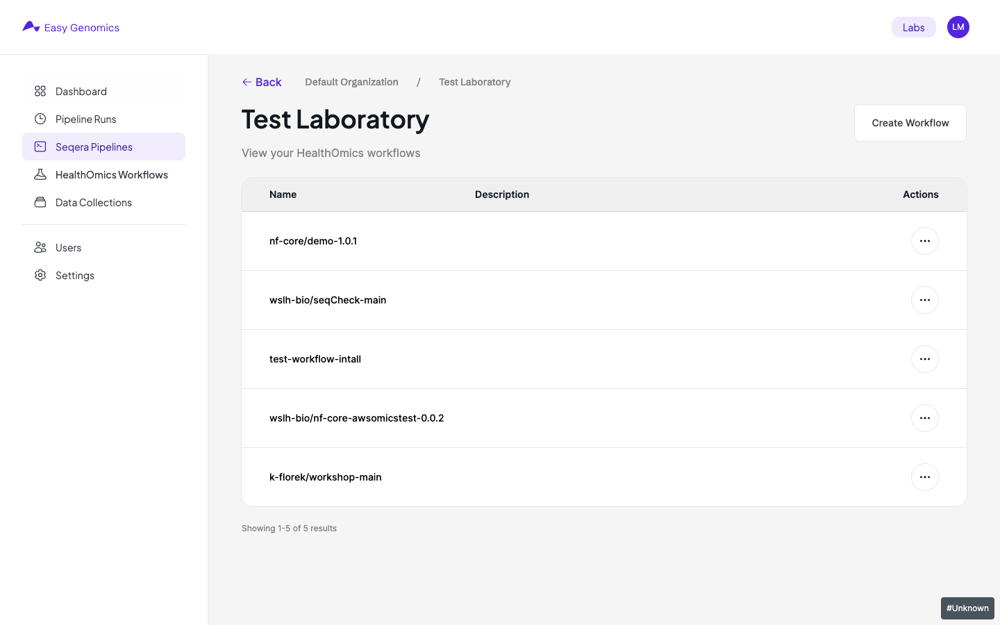

2. Row menu → **Run** (same upload steps as [section 5](#5-upload-sample-data)).
3. **Parameters:** review **Input** and **outdir** → **Save & Continue**.

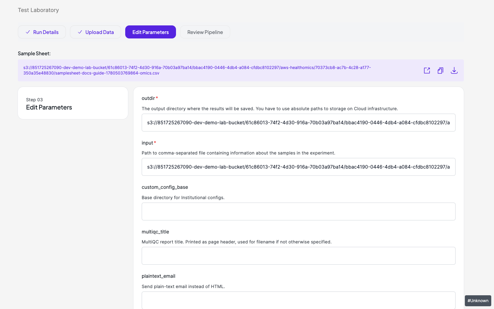

4. **Review:** choose **Launch Workflow Run**.
5. Choose **Back to Runs** to open **Pipeline Runs**.

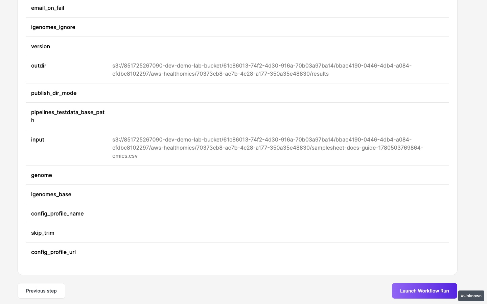

### Monitor runs

1. Open the lab → **Pipeline Runs** (both platforms use this tab).
2. Find your run by name. New runs typically show status **Submitted** while Seqera Cloud or HealthOmics processes them.
3. Row menu → **View Details** for run metadata, platform badge (**Seqera Cloud** or **AWS HealthOmics**), sample sheet
   link, and status updates.

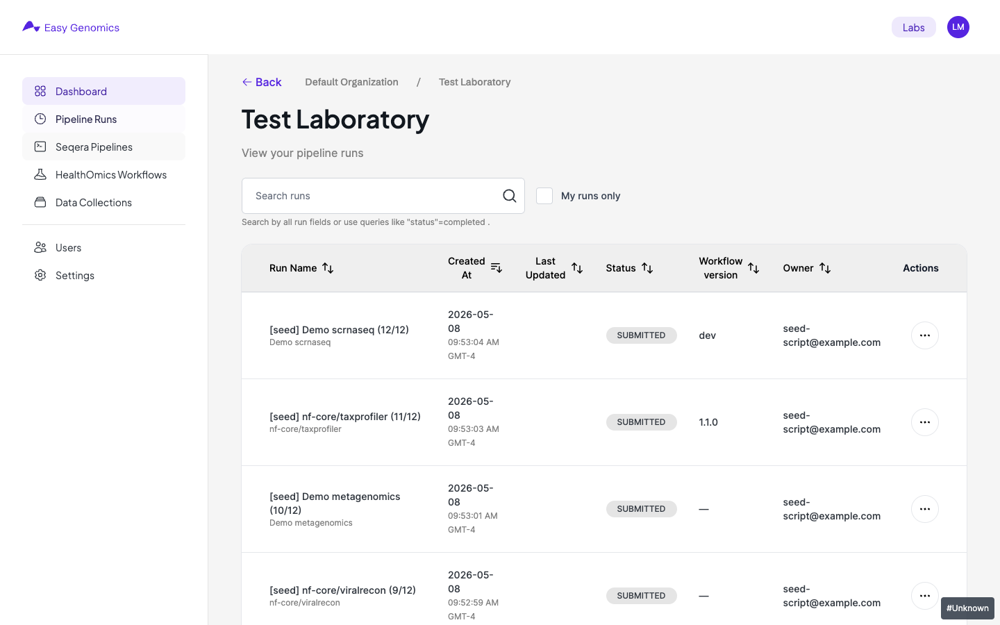

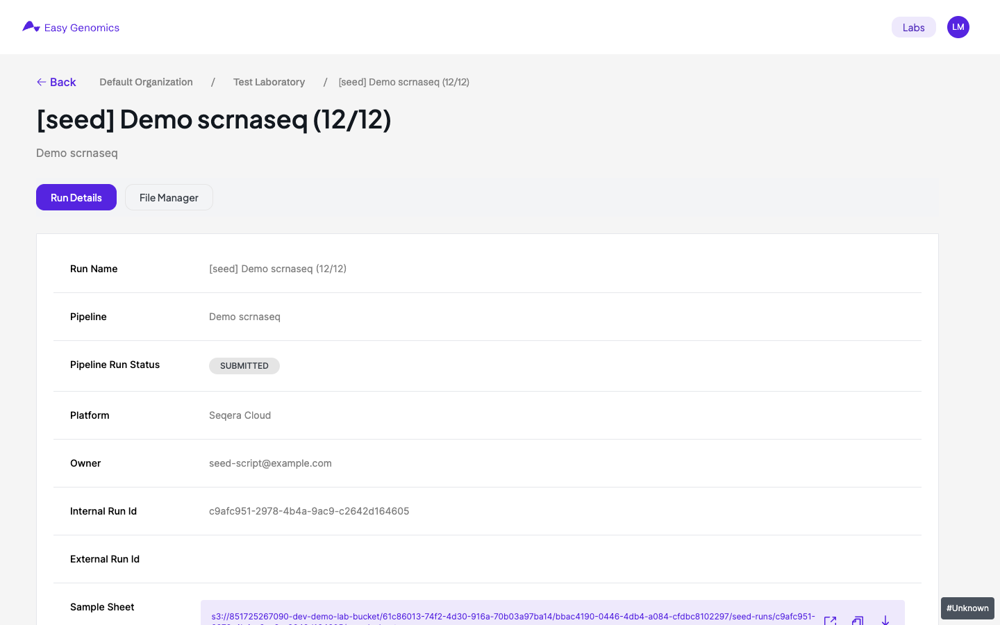

Pipeline names in your environment depend on your Seqera workspace and HealthOmics account (for example
`quality-e2e-test-pipeline` on Seqera or `k-florek/workshop-main` on HealthOmics).

---

## 7. Read run results and download outputs

1. From **Run details**, open the **File Manager** tab.
2. Browse files under the run’s S3 prefix—input FASTQs, the generated `samplesheet-{runName}.csv`, and (as the external
   run completes) workflow outputs.
3. Use the download action on a file row. Your browser should show **Your files have begun downloading**.

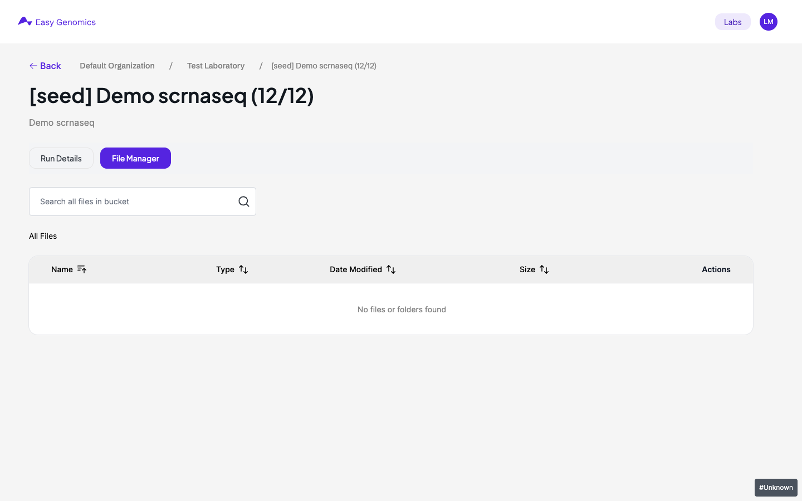

Reports and final outputs from Seqera Cloud or HealthOmics appear in File Manager as the external run finishes. Refresh
the run details page to see updated status.

---

## What’s next

- **Pipeline authoring and configuration** — see [Nextflow documentation](https://www.nextflow.io/docs/latest/) and
  [Seqera Platform documentation](https://docs.seqera.io/).
- **Operational issues** — troubleshooting is covered in a separate guide (DOCS-06).

You have now completed the core Easy Genomics setup: organization, lab, integrations, team access, data upload, and a
first workflow run on Seqera Cloud and/or AWS HealthOmics.
